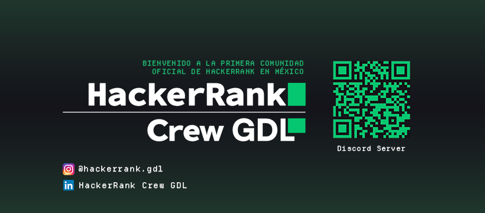

# HackerRank Crew GDL

The central portal for HackerRank Crew GDL's technical sessions, workshops, and interactive presentations. This project is built as a high-performance monorepo to host both the main discovery hub and independent slide decks.



## Architecture

This repository uses **pnpm workspaces** to manage multiple packages:

- **`apps/hub`**: The main landing page and session navigator built with **Astro**.
- **`sessions/`**: A collection of interactive presentations built with **Slidev** (Vue +  UnoCSS).

## Tech Stack

- **Core**: Astro, Slidev, TypeScript.
- **Styling**: UnoCSS (sessions), Starlight design system (hub).
- **Package Management**: pnpm.
- **Automation**: Custom build orchestrator with local caching (`build.mjs`).

## Getting Started

### Prerequisites
- Node.js (Latest LTS recommended)
- pnpm (`npm install -g pnpm`)

### Installation
```bash
pnpm install
```

### Development

To start the main hub (slides served from last build):
```bash
pnpm dev
```

To work on a specific session with **Hot Module Replacement (HMR)**, run both servers in parallel:

```bash
# Terminal 1 — start the Slidev session you want to work on
pnpm --filter <session-name> dev

# Terminal 2 — start the hub (auto-detects the running Slidev port)
pnpm dev
```

> Session names match their directory names under `sessions/`.

## Asset Management

Assets (fonts, logos, images) are centrally managed via the `@hr-gdl/shared-assets` package:

- **Location**: `packages/shared-assets/`
- **Exports**: Granular exports for fonts, logos, and images
- **Distribution**: Each project prebuild copies assets to `public/`
- **Benefits**: Single source of truth, reduced duplication, easy maintenance

To sync assets after installation:
```bash
pnpm install          # Links @hr-gdl/shared-assets
pnpm -r prebuild      # Copies assets to all project public directories
```

## Building for Production

We use a custom build script that optimizes the deployment by caching unchanged sessions:

```bash
pnpm build
```

The build orchestrator (`build.mjs`):
1. Runs prebuild to ensure assets are synced
2. Checks for file changes in each session directory
3. Skips building sessions that haven't changed (local cache)
4. Compiles the Hub and embeds the static slide decks into `public/slides/`

## Brand Identity

This project adheres to the HackerRank Brand Guides. All assets, logos, and typography (Montserrat, Satoshi, Departure Mono) are managed within the respective application assets or shared public folders.

## Legal Disclaimer

This is a community-led project managed by the **HackerRank Crew Guadalajara**. It is not an official product of HackerRank Ltd. All HackerRank logos and trademarks are the property of HackerRank Ltd. and are used here for community educational purposes under community brand guidelines.

## License

This project is licensed under the [MIT License](LICENSE).
